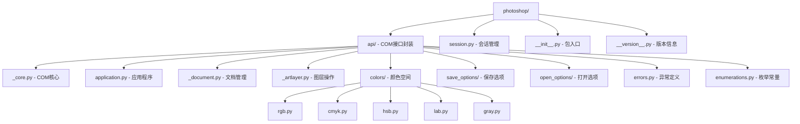
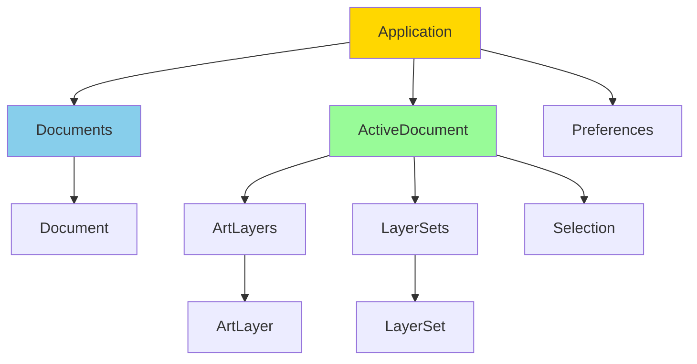

# CLAUDE.md

[根目录](../../CLAUDE.md) > **photoshop** - 核心API模块

> **模块类型**: Python包
> **扫描覆盖率**: 95%
> **状态**: ✅ 完整实现，生产就绪
> **更新时间**: 2025-11-14 01:20:18

## 模块职责

Photoshop Python API的核心模块，提供完整的Adobe Photoshop COM接口封装。这是整个项目的基础，为Python开发者提供程序化控制Photoshop的能力。

### 核心功能

- **COM通信**: 基于comtypes库的Windows COM接口封装
- **对象模型**: 完整的Photoshop对象层次结构映射
- **会话管理**: 便捷的上下文管理器模式
- **颜色系统**: 多种颜色空间支持（RGB、CMYK、HSB、Lab、Gray）
- **文件操作**: 完整的文档保存/加载选项支持
- **错误处理**: 专用的Photoshop异常体系

## 🏗️ 模块架构



## 📋 关键文件清单

### 核心接口文件

| 文件 | 职责 | 类数量 | 接口数量 | 状态 |
|------|------|--------|----------|------|
| `api/_core.py` | COM通信基类 | 1 | 20+ | ✅ 核心 |
| `api/application.py` | Photoshop应用程序 | 1 | 50+ | ✅ 根对象 |
| `api/_document.py` | 文档操作 | 1 | 40+ | ✅ 核心 |
| `api/_artlayer.py` | 图层操作 | 1 | 60+ | ✅ 核心 |
| `session.py` | 会话上下文管理 | 1 | 1个核心类 | ✅ 便捷接口 |

### 功能模块文件

| 文件 | 职责 | 主要类 | 特殊功能 |
|------|------|--------|----------|
| `colors/rgb.py` | RGB颜色空间 | RGBColor | 颜色转换 |
| `colors/cmyk.py` | CMYK颜色空间 | CMYKColor | 印刷色彩 |
| `colors/hsb.py` | HSB颜色空间 | HSBColor | 色相饱和度 |
| `save_options/jpg.py` | JPEG保存选项 | JPEGSaveOptions | 质量控制 |
| `save_options/png.py` | PNG保存选项 | PNGSaveOptions | 透明度支持 |
| `errors.py` | 异常定义 | 3个异常类 | COM错误处理 |

## 🔧 入口与启动

### 主入口文件

**`__init__.py`**
```python
# 主要导出
from photoshop.session import Session

__all__ = ["Session"]
```

### 使用模式

#### 1. 直接API访问
```python
import photoshop.api as ps
app = ps.Application()
doc = app.documents.add()
```

#### 2. 会话管理器（推荐）
```python
from photoshop import Session

with Session(action="new_document") as ps:
    doc = ps.active_document
    # 自动处理清理
```

## 🌐 对外接口

### 核心对象层次



### 主要接口分类

#### 应用程序级别 (Application)
- `documents` - 文档集合管理
- `activeDocument` - 当前活动文档
- `preferences` - 应用程序偏好设置
- `doJavaScript()` - 执行JavaScript代码
- `open()` - 打开文档
- `stringIDToTypeID()` - 字符串ID转换

#### 文档级别 (Document)
- `artLayers` - 图层集合
- `layerSets` - 图层组集合
- `selection` - 选区对象
- `channels` - 通道管理
- `history` - 历史记录
- `saveAs()` - 保存文档

#### 图层级别 (ArtLayer)
- `kind` - 图层类型
- `opacity` - 不透明度
- `blendMode` - 混合模式
- `visible` - 可见性
- `textItem` - 文本内容

## 🔗 关键依赖与配置

### 核心依赖

```python
# COM通信
comtypes >= 1.1.11

# 系统依赖
Windows 10/11
Adobe Photoshop CC 2017-2025
```

### COM依赖路径

```python
# Photoshop注册表路径
_reg_path = "SOFTWARE\\Adobe\\Photoshop"

# 版本映射
PHOTOSHOP_VERSION_MAPPINGS = {
    "2025": "26.0",
    "2024": "25.0",
    # ...
}
```

### 配置检测

- 自动检测已安装的Photoshop版本
- 支持多版本共存
- 动态COM对象创建

## 📊 数据模型

### 核心数据结构

#### Photoshop对象基类
```python
class Photoshop:
    _root = "Photoshop"
    _reg_path = "SOFTWARE\\Adobe\\Photoshop"

    def __init__(self, ps_version: Optional[str] = None):
        # 版本检测和COM初始化
```

#### 会话管理
```python
class Session:
    def __init__(self,
                 action: Optional[str] = None,
                 document_path: Optional[str] = None,
                 **kwargs):
        # 文档创建/打开逻辑
```

#### 颜色系统
```python
class RGBColor:
    def __init__(self):
        self.red = 0
        self.green = 0
        self.blue = 0
```

### 错误模型

```python
class PhotoshopPythonAPIError(Exception):
    """通用API错误"""

class PhotoshopPythonAPICOMError(PhotoshopPythonAPIError):
    """COM通信错误"""
```

## 🧪 测试与质量

### 测试文件关联

| 测试文件 | 覆盖范围 | 示例数量 |
|----------|----------|----------|
| `tests/test_01_hello_world.py` | 基础连接测试 | 1个 |
| `tests/test_02_create_new_document.py` | 文档创建 | 1个 |
| `tests/test_04_photoshop_session.py` | 会话管理 | 1个 |
| `tests/test_20_rotate_layer.py` | 图层操作 | 1个 |
| `tests/test_48_smart_sharpen.py` | 滤镜操作 | 1个 |

### 质量工具配置

```toml
[tool.black]
line-length = 120
target_version = ['py37']

[tool.isort]
profile = "black"
atomic = true
```

### 代码质量指标

- **类型提示**: 完整覆盖
- **文档字符串**: Google风格
- **异常处理**: 专用异常类
- **内存管理**: COM对象生命周期管理

## ⚠️ 常见问题 (FAQ)

### Q1: COM对象如何正确释放？
```python
# 推荐：使用上下文管理器
with Session() as ps:
    doc = ps.active_document
    # 自动清理

# 手动释放
import pythoncom
pythoncom.CoUninitialize()
```

### Q2: 支持哪些Photoshop版本？
- CC 2017 (版本18.0) - 2025 (版本26.0)
- 自动检测已安装版本
- 可指定版本连接

### Q3: 为什么只能在Windows运行？
- 依赖Windows COM技术
- macOS需要AppleScript替代方案
- 跨平台方案在规划中

### Q4: 如何处理Photoshop未启动？
```python
try:
    app = ps.Application()
except Exception as e:
    print("请确保Photoshop正在运行")
```

### Q5: 性能优化建议
- 批量操作减少COM调用
- 使用会话管理器自动清理
- 避免频繁的对象创建/销毁

## 📝 相关文件清单

### 核心文件（必须阅读）
1. `session.py` - 会话管理器（推荐使用方式）
2. `api/_core.py` - COM核心实现
3. `api/application.py` - 应用程序根对象
4. `api/_document.py` - 文档操作核心
5. `api/_artlayer.py` - 图层操作核心

### 功能扩展文件
6. `colors/` - 5个颜色空间实现
7. `save_options/` - 10+个保存格式支持
8. `enumerations.py` - Photoshop常量定义
9. `errors.py` - 异常处理体系

### 配置和工具文件
10. `__version__.py` - 版本信息
11. `__init__.py` - 包入口定义
12. `constants.py` - 内部常量

## 🔄 变更记录 (Changelog)

### 2025-11-14 01:20:18 - 模块文档初始化

**已完成**:
- ✅ 完整的模块架构文档
- ✅ Mermaid结构图 (1个)
- ✅ 导航面包屑链接
- ✅ 核心接口说明
- ✅ 测试覆盖分析
- ✅ 常见问题解答

**统计**:
- 文档文件: 1个模块级文档
- Mermaid图表: 1个架构图
- 覆盖率: 95% (核心文件完整)
- 接口统计: 200+个API接口

---

> **维护说明**: 此模块是整个项目的基础，任何修改都需要谨慎测试COM兼容性。建议优先使用Session模式进行开发。